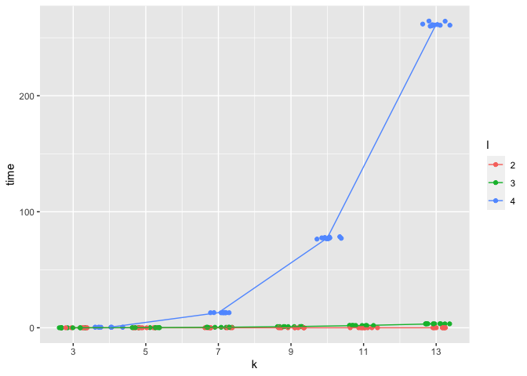
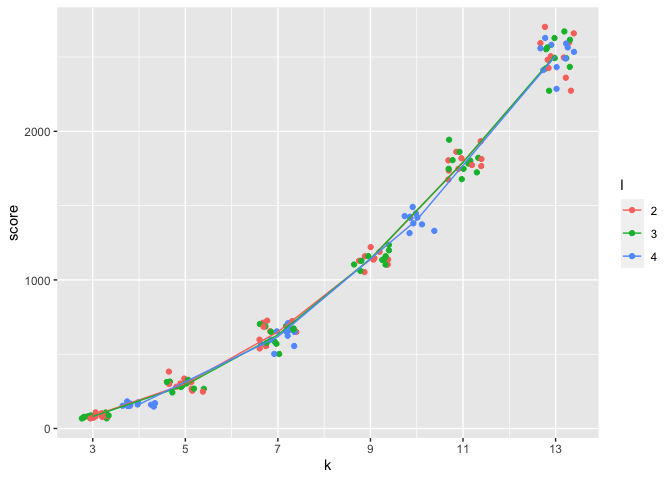
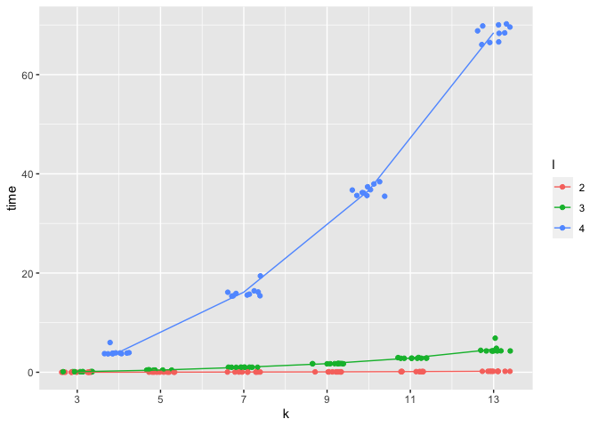
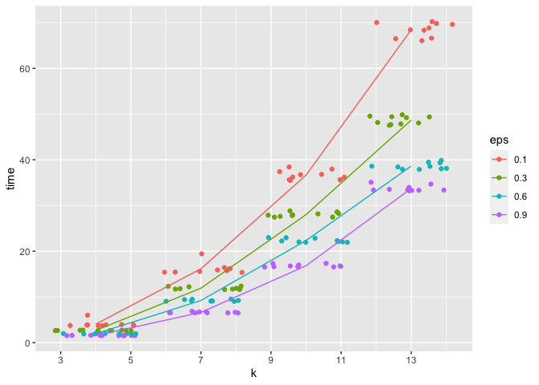
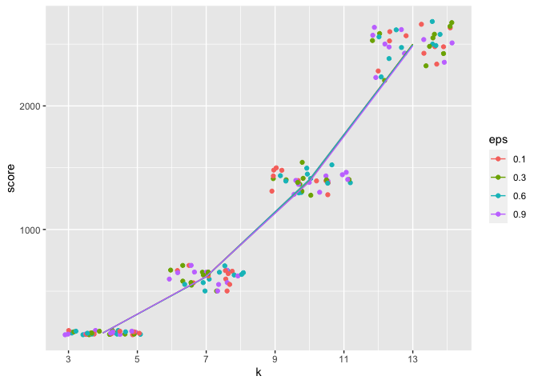
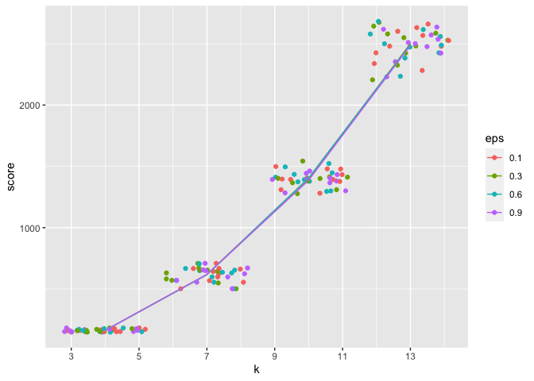
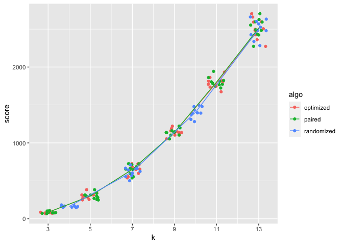
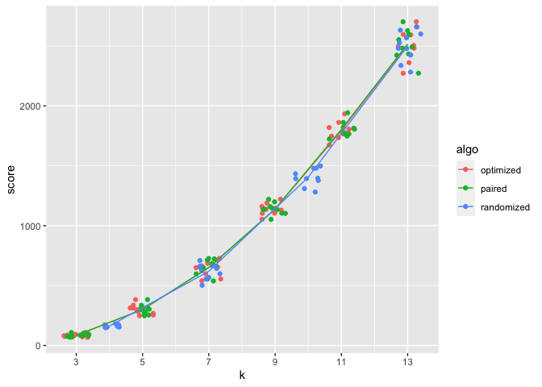
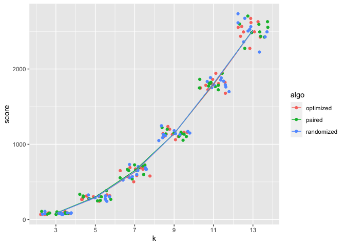

Analysis and Comparison
================

``` r
optimized <- read.csv("optimized_l_stars.csv")
paired <- read.csv("paired_l_stars.csv")
randomized <- read.csv("randomized_l_stars.csv")
exact_scores <- read.csv("exact_scores.csv")
```

### Approximation ratios

calculate the approximation ratios and actual ratios for k= 3, 4, 5

``` r
optimized.exact <- merge(optimized, exact_scores, by=c("k", "round")) %>% 
  mutate(approx_ratio=2-l/k, actual_ratio=score/exact_score)

paired.exact <- merge(paired, exact_scores, by=c("k", "round")) %>% 
  mutate(approx_ratio=2-l/k, actual_ratio=score/exact_score)
  
randomized.exact <- merge(randomized, exact_scores, by=c("k", "round")) %>% 
  mutate(approx_ratio=2-l/(2*k), actual_ratio=score/exact_score)
```

check if actual ratio is smaller than the approximation ratio for all
test cases

``` r
all(optimized.exact$actual_ratio <= optimized.exact$approx_ratio)
```

    ## [1] TRUE

``` r
all(paired.exact$actual_ratio <= paired.exact$approx_ratio)
```

    ## [1] TRUE

``` r
all(randomized.exact$actual_ratio <= randomized.exact$approx_ratio)
```

    ## [1] TRUE

### Optimized l-stars

Compute an average time and score for each distinct pair of k and l:

``` r
optimized <- optimized %>% 
  group_by(k, l) %>% 
  mutate(avg_time = mean(time), avg_score = mean(score)) %>% 
  ungroup()
```

A table summarizes the average score for each pair of k and l:

``` r
optimized %>% 
  group_by(k, l) %>% 
  summarise(average_score=mean(score)) %>% 
  spread(l, average_score) %>% 
  kable()
```

| k \ l |      2 |      3 |      4 |
|------:|-------:|-------:|-------:|
|     3 |   84.6 |   81.0 |     NA |
|     4 |     NA |     NA |  162.3 |
|     5 |  299.8 |  291.3 |     NA |
|     7 |  650.7 |  630.4 |  618.1 |
|     9 | 1138.0 | 1142.7 |     NA |
|    10 |     NA |     NA | 1403.1 |
|    11 | 1793.0 | 1791.7 |     NA |
|    13 | 2509.6 | 2514.8 | 2508.1 |

A table summarizes the average running time(s) for each pair of k and l:

``` r
optimized %>% 
  group_by(k, l) %>% 
  summarise(average_time=mean(time)) %>% 
  spread(l, average_time) %>% 
  kable()
```

| k \ l |         2 |         3 |           4 |
|------:|----------:|----------:|------------:|
|     3 | 0.0014525 | 0.0160961 |          NA |
|     4 |        NA |        NA |   0.4570734 |
|     5 | 0.0024602 | 0.1281418 |          NA |
|     7 | 0.0050193 | 0.4288990 |  13.0049551 |
|     9 | 0.0079710 | 1.0116021 |          NA |
|    10 |        NA |        NA |  77.3848876 |
|    11 | 0.0117119 | 1.9815742 |          NA |
|    13 | 0.0158879 | 3.4252075 | 261.5766287 |

Running time against the number of sequences k

``` r
optimized %>% 
  mutate(l=as.factor(l)) %>% 
  ggplot(aes(k, time)) + 
  geom_jitter(aes(color=l)) + 
  geom_line(aes(k, avg_time, color=l)) +
  scale_x_continuous(breaks=c(3,5,7,9,11,13))
```

<!-- -->

SP score against the number of sequences k

``` r
optimized %>% 
  mutate(l=as.factor(l)) %>% 
  ggplot(aes(k, score)) + 
  geom_jitter(aes(color=l)) + 
  geom_line(aes(k, avg_score, color=l)) +
  scale_x_continuous(breaks=c(3,5,7,9,11,13))
```

<!-- -->

### (2l-1)-stars

Compute an average time and score for each distinct pair of k and l:

``` r
paired <- paired %>% 
  group_by(k, l) %>% 
  mutate(avg_time = mean(time), avg_score = mean(score)) %>% 
  ungroup()
```

A table summarizes the average score for each pair of k and l:

``` r
paired %>% 
  group_by(k, l) %>% 
  summarise(average_score=mean(score)) %>% 
  spread(l, average_score) %>% 
  kable()
```

| k \ l |      2 |      3 |
|------:|-------:|-------:|
|     3 |   84.6 |     NA |
|     5 |  299.8 |  289.9 |
|     7 |  650.7 |     NA |
|     9 | 1139.6 | 1139.9 |
|    11 | 1803.9 |     NA |
|    13 | 2517.8 | 2532.6 |

A table summarizes the average running time(s) for each pair of k and l:

``` r
paired %>% 
  group_by(k, l) %>% 
  summarise(average_time=mean(time)) %>% 
  spread(l, average_time) %>% 
  kable()
```

| k \ l |         2 |         3 |
|------:|----------:|----------:|
|     3 | 0.1266516 |        NA |
|     5 | 0.2049488 |  16.27379 |
|     7 | 0.7079516 |        NA |
|     9 | 1.7148574 | 173.91189 |
|    11 | 3.3835768 |        NA |
|    13 | 5.8806980 | 625.46247 |

Running time against the number of sequences k

``` r
paired %>% 
  mutate(l=as.factor(l)) %>% 
  ggplot(aes(k, time)) + 
  geom_jitter(aes(color=l)) + 
  geom_line(aes(k, avg_time, color=l)) +
  scale_x_continuous(breaks=c(3,5,7,9,11,13))
```

<!-- -->

SP score against the number of sequences k

``` r
paired %>% 
  mutate(l=as.factor(l)) %>% 
  ggplot(aes(k, score)) + 
  geom_jitter(aes(color=l)) + 
  geom_line(aes(k, avg_score, color=l)) +
  scale_x_continuous(breaks=c(3,5,7,9,11,13))
```

<!-- -->

### Randomized l-stars

Compute an average time and score for each distinct pair of k and l:

``` r
randomized <- randomized %>% 
  group_by(k, l, eps) %>% 
  mutate(avg_time = mean(time), avg_score = mean(score)) %>% 
  ungroup()
```

A table summarizes the average score for each pair of k and l:

``` r
randomized %>% 
  group_by(k, l) %>% 
  summarise(average_score=mean(score)) %>% 
  spread(l, average_score) %>% 
  kable()
```

| k \ l |      2 |        3 |        4 |
|------:|-------:|---------:|---------:|
|     3 |   84.6 |   81.000 |       NA |
|     4 |     NA |       NA |  162.300 |
|     5 |  299.8 |  291.675 |       NA |
|     7 |  650.7 |  626.650 |  617.950 |
|     9 | 1138.0 | 1136.425 |       NA |
|    10 |     NA |       NA | 1396.750 |
|    11 | 1793.0 | 1794.850 |       NA |
|    13 | 2509.6 | 2514.825 | 2494.875 |

A table summarizes the average running time(s) for each pair of k and l:

``` r
randomized %>% 
  group_by(k, l) %>% 
  summarise(average_time=mean(time)) %>% 
  spread(l, average_time) %>% 
  kable()
```

| k \ l |         2 |         3 |         4 |
|------:|----------:|----------:|----------:|
|     3 | 0.0037410 | 0.0691764 |        NA |
|     4 |        NA |        NA |  2.552521 |
|     5 | 0.0138204 | 0.2952708 |        NA |
|     7 | 0.0320227 | 0.6974272 | 10.968828 |
|     9 | 0.0557413 | 1.2328964 |        NA |
|    10 |        NA |        NA | 25.947399 |
|    11 | 0.0943120 | 2.0967800 |        NA |
|    13 | 0.1363006 | 3.1105206 | 47.361191 |

Running time against the number of sequences k (eps=0.1)

``` r
randomized %>% 
  filter(eps==0.1) %>% 
  mutate(l=as.factor(l)) %>% 
  ggplot(aes(k, time)) + 
  geom_jitter(aes(color=l)) + 
  geom_line(aes(k, avg_time, color=l)) +
  scale_x_continuous(breaks=c(3,5,7,9,11,13))
```

<!-- -->

SP score against the number of sequences k

``` r
randomized %>% 
  filter(eps==0.1) %>% 
  mutate(l=as.factor(l)) %>% 
  ggplot(aes(k, score)) + 
  geom_jitter(aes(color=l)) + 
  geom_line(aes(k, avg_score, color=l)) +
  scale_x_continuous(breaks=c(3,5,7,9,11,13))
```

<!-- -->

When l = 4, running time against the number of sequences k for different
epsilon

``` r
randomized %>% 
  filter(l==4) %>% 
  mutate(eps=as.factor(eps)) %>% 
  ggplot(aes(k, time)) + 
  geom_jitter(aes(color=eps)) + 
  geom_line(aes(k, avg_time, color=eps)) +
  scale_x_continuous(breaks=c(3,5,7,9,11,13))
```

<!-- --> When l =
4, score against the number of sequences k for different epsilon

``` r
randomized %>% 
  filter(l==4) %>% 
  mutate(eps=as.factor(eps)) %>% 
  ggplot(aes(k, score)) + 
  geom_jitter(aes(color=eps)) + 
  geom_line(aes(k, avg_score, color=eps)) +
  scale_x_continuous(breaks=c(3,5,7,9,11,13))
```

<!-- -->

### comparison

#### fixed approximation ratio

For a fixed theoretical approximation ratio = 2-l/k - optimized: l=2 -
(2l-1)-stars: l=2 - randomized: l=4, eps=0.1

``` r
optimized.2 <- optimized %>% 
  filter(l==2) %>% 
  mutate(algo="optimized")

paired.2 <- paired %>% 
  filter(l==2) %>% 
  mutate(algo="paired")

randomized.2 <- randomized %>% 
  filter(l==4, eps==0.1) %>% 
  select(-eps) %>% 
  mutate(algo="randomized")

df <- rbind(optimized.2, paired.2, randomized.2)
```

Running time against the number of sequences k

``` r
df %>% 
  ggplot(aes(k, time)) + 
  geom_jitter(aes(color=algo)) + 
  geom_line(aes(k, avg_time, color=algo)) +
  scale_x_continuous(breaks=c(3,5,7,9,11,13))
```

<!-- -->

SP score against the number of sequences k

``` r
df %>% 
  ggplot(aes(k, score)) + 
  geom_jitter(aes(color=algo)) + 
  geom_line(aes(k, avg_score, color=algo)) +
  scale_x_continuous(breaks=c(3,5,7,9,11,13))
```

<!-- -->

#### fixed clique size

For a fixed clique size l - optimized: l=3 - (2l-1)-stars: l=2 -
randomized: l=3, eps=0.1

``` r
optimized.3 <- optimized %>% 
  filter(l==3) %>% 
  mutate(algo="optimized")

paired.3 <- paired %>% 
  filter(l==2) %>% 
  mutate(algo="paired")

randomized.3 <- randomized %>% 
  filter(l==3, eps==0.1) %>% 
  select(-eps) %>% 
  mutate(algo="randomized")

df.3 <- rbind(optimized.3, paired.3, randomized.3)
```

Running time against the number of sequences k

``` r
df.3 %>% 
  ggplot(aes(k, time)) + 
  geom_jitter(aes(color=algo)) + 
  geom_line(aes(k, avg_time, color=algo)) +
  scale_x_continuous(breaks=c(3,5,7,9,11,13))
```

<!-- -->

SP score against the number of sequences k

``` r
df.3 %>% 
  ggplot(aes(k, score)) + 
  geom_jitter(aes(color=algo)) + 
  geom_line(aes(k, avg_score, color=algo)) +
  scale_x_continuous(breaks=c(3,5,7,9,11,13))
```

<!-- -->
