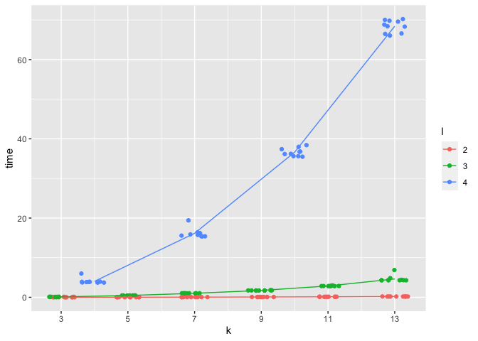
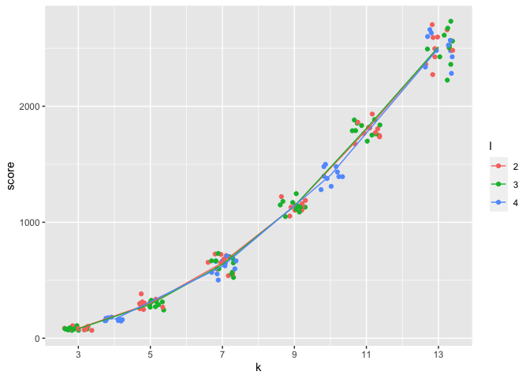

Analysis and Comparison
================

``` r
optimized <- read.csv("optimized_l_stars.csv")
paired <- read.csv("paired_l_stars.csv")
randomized <- read.csv("randomized_l_stars.csv")
```

### Optimized l-stars

Compute an average time and score for each distinct pair of k and l:

``` r
optimized <- optimized %>% 
  group_by(k, l) %>% 
  mutate(avg_time = mean(time), avg_score = mean(score)) %>% 
  ungroup()
```

Running time against the number of sequences k

``` r
optimized %>% 
  mutate(l=as.factor(l)) %>% 
  ggplot(aes(k, time)) + 
  geom_jitter(aes(color=l)) + 
  geom_line(aes(k, avg_time, color=l)) +
  scale_x_continuous(breaks=c(3,5,7,9,11,13))
```

<!-- -->

SP score against the number of sequences k

``` r
optimized %>% 
  mutate(l=as.factor(l)) %>% 
  ggplot(aes(k, score)) + 
  geom_jitter(aes(color=l)) + 
  geom_line(aes(k, avg_score, color=l)) +
  scale_x_continuous(breaks=c(3,5,7,9,11,13))
```

<!-- -->

### (2l-1)-stars

Compute an average time and score for each distinct pair of k and l:

``` r
paired <- paired %>% 
  group_by(k, l) %>% 
  mutate(avg_time = mean(time), avg_score = mean(score)) %>% 
  ungroup()
```

Running time against the number of sequences k

``` r
paired %>% 
  mutate(l=as.factor(l)) %>% 
  ggplot(aes(k, time)) + 
  geom_jitter(aes(color=l)) + 
  geom_line(aes(k, avg_time, color=l)) +
  scale_x_continuous(breaks=c(3,5,7,9,11,13))
```

<!-- -->

SP score against the number of sequences k

``` r
paired %>% 
  mutate(l=as.factor(l)) %>% 
  ggplot(aes(k, score)) + 
  geom_jitter(aes(color=l)) + 
  geom_line(aes(k, avg_score, color=l)) +
  scale_x_continuous(breaks=c(3,5,7,9,11,13))
```

<!-- -->

### Randomized l-stars (epsilon=0.1)

Compute an average time and score for each distinct pair of k and l:

``` r
randomized.1 <- randomized %>% 
  filter(eps==0.1) %>% 
  group_by(k, l) %>% 
  mutate(avg_time = mean(time), avg_score = mean(score)) %>% 
  ungroup()
```

Running time against the number of sequences k

``` r
randomized.1 %>% 
  mutate(l=as.factor(l)) %>% 
  ggplot(aes(k, time)) + 
  geom_jitter(aes(color=l)) + 
  geom_line(aes(k, avg_time, color=l)) +
  scale_x_continuous(breaks=c(3,5,7,9,11,13))
```

<!-- -->

SP score against the number of sequences k

``` r
randomized.1 %>% 
  mutate(l=as.factor(l)) %>% 
  ggplot(aes(k, score)) + 
  geom_jitter(aes(color=l)) + 
  geom_line(aes(k, avg_score, color=l)) +
  scale_x_continuous(breaks=c(3,5,7,9,11,13))
```

<!-- -->
